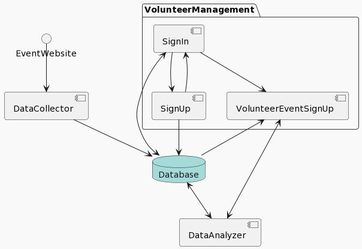

## Introduction
The Volunteer Management System (VMS) is a comprehensive web application designed to facilitate volunteer sign up participation in events. It serves as a platform for volunteers to sign up for available opportunities which are populated from the internet.

## Objectives
- To offer a platform for the sign-up process for volunteers, ensuring no overbooking.
- To maintain an organized schedule that prevents shift overlaps and hiding irrelevant/expired events.
- To fetch events from the internet to give a single page of events for volunteers’ ease of access

## Features
- Sign In/Sign Up: A welcoming page with options for volunteers to sign up or login.
- Volunteer Event Sign Up page: Enables volunteers to browse and sign up for events.
- Data Collector: Gathers and stores volunteer sign-ups and the events postings from different pages in the internet.
- Data Analyzer: Provides statistics on the data given in the database.
- Database: SQL for all application data.

## Architecture
The application’s architecture is designed for ease of use. The UML diagram below provides a visual representation of the user flow and system components.

### Successfully deployed app on [this link](https://volunteeringmanagement-effc1f30f74b.herokuapp.com/).